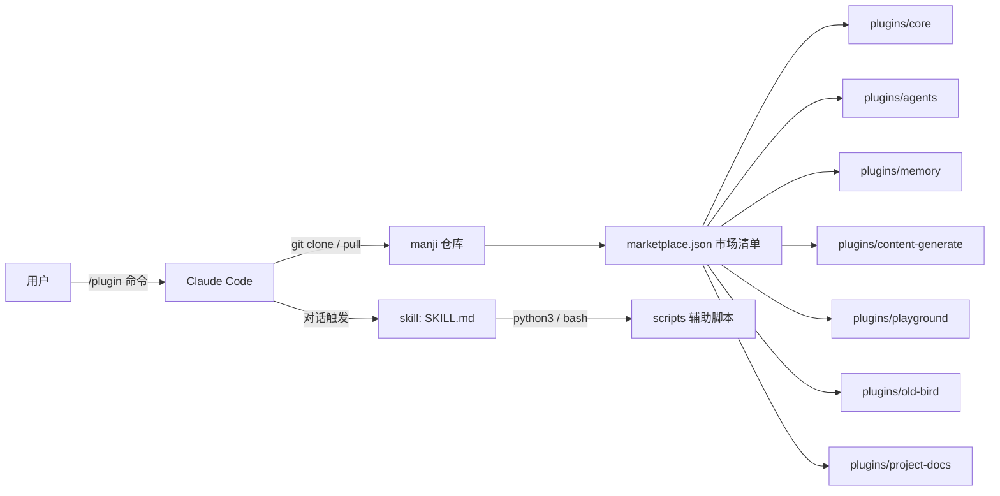
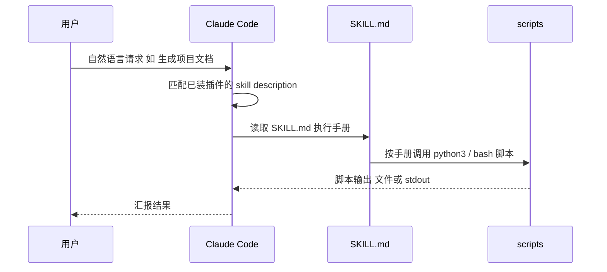

## 系统架构

manji 没有服务端 —— 它是一个被 Claude Code 消费的**静态插件仓库**。三方关系如下：

- **marketplace.json**（`.claude-plugin/marketplace.json`）— 唯一的市场入口。owner、metadata.version、`plugins[]` 数组；Claude Code 添加市场后读它发现插件。
- **plugins/<name>/**（7 个）— 每个插件自治：自带 `plugin.json` 清单、README、若干 skill。插件之间**互不依赖**，可独立安装。
- **skill**（18 个）— 真正干活的单元。`SKILL.md` 的 frontmatter `description` 决定 Claude 何时自动触发；正文是给 Claude 的执行手册。
- **scripts/**（市场级）— `version-check.sh` 检查市场新版本（结果缓存于 `~/.manji/`），`manji-upgrade.sh` 执行更新。由 `plugins/core` 的 version-update skill 调用。

## 模块划分

| 模块 | 职责 | 位置 | 依赖 |
|------|------|------|------|
| 市场清单 | 注册插件、市场元信息 | `.claude-plugin/marketplace.json` | 无 |
| core | 版本检测、自动更新、频率控制 | `plugins/core/` | `scripts/*.sh` |
| agents | 调度 Cursor 等外部 AI CLI | `plugins/agents/` | 本机 cursor CLI |
| memory | 跨会话记忆（5 skill、3 后端） | `plugins/memory/` | OpenViking/MCP/mem0 任一 |
| content-generate | 公众号写作→审核→封面→发布（7 skill） | `plugins/content-generate/` | 部分 skill 需 OSS/微信配置 |
| playground | 趣味实验（mbti-test） | `plugins/playground/` | 无 |
| old-bird | 私房工作流蒸馏（local-distill-me） | `plugins/old-bird/` | 无 |
| project-docs | 新手接手文档生成（md + HTML） | `plugins/project-docs/` | 无 |
| 顶层 agents | 独立 agent 人设（content-publisher Soul.md） | `agents/` | content-generate |

## 数据流

一次典型的「用户使用 skill」的数据流：

## 关键设计决策

- **零第三方依赖**：所有 Python 脚本只用 stdlib —— 用户装插件不应被迫 pip install。这是贡献时最常被 review 卡住的点。
- **插件按主题聚合而非按 skill 拆散**：一个插件收多个相关 skill（如 content-generate 收 7 个），安装粒度对用户更友好。
- **双清单同步**：新插件必须同时改 `plugins/<name>/.claude-plugin/plugin.json` 和根 `marketplace.json`，并给市场 `metadata.version` 升版 —— 这两个文件是 git 热点（各改过 10 次），漏一个就是最常见的 PR 问题。
- **SKILL.md 即产品**：frontmatter description 写得好不好直接决定 skill 会不会被 Claude 触发；正文按"给 Claude 的操作手册"写，不是给人看的教程。
