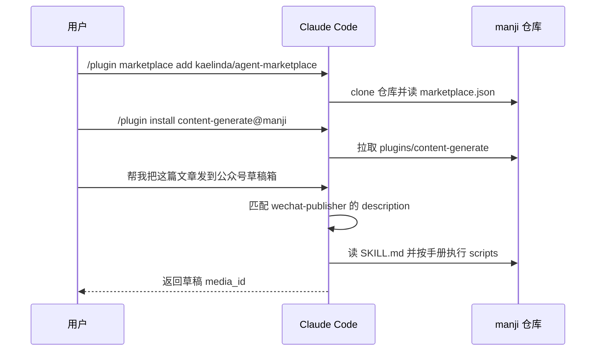
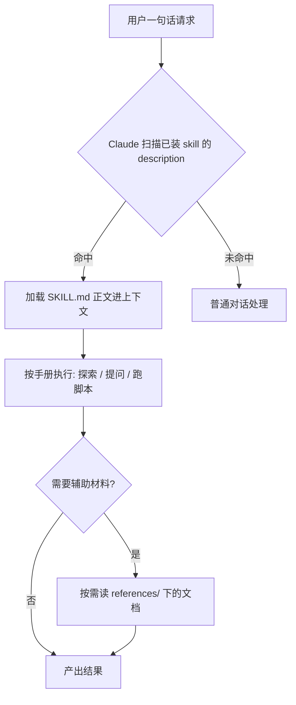
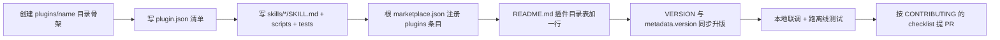
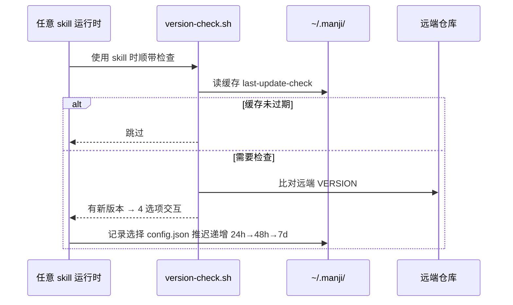

## 流程一：用户安装并使用插件

用户视角的主链路 —— 从添加市场到 skill 干活。

1. 添加市场：Claude Code 读 `.claude-plugin/marketplace.json` 拿到 `plugins[]`（`.claude-plugin/marketplace.json`）
2. 安装插件：按 `source` 字段定位 `plugins/<name>/`，读 `plugin.json`
3. 对话触发：Claude 用各 skill frontmatter 的 `description` 做语义匹配
4. 执行：按 SKILL.md 正文的手册跑 `scripts/` 下的脚本

**关键文件**：`.claude-plugin/marketplace.json`、`plugins/<name>/.claude-plugin/plugin.json`、`plugins/<name>/skills/<skill>/SKILL.md`

## 流程二：skill 的触发与执行

理解这条链路才能写好 SKILL.md —— 它是本仓库最核心的"业务逻辑"。

要点：`description` 是**触发器**（写场景与触发词），正文是**执行手册**（写步骤与硬性要求），`references/` 是**按需知识**（大而全的细节别塞进 SKILL.md，会浪费上下文）。

**关键文件**：任意 `plugins/*/skills/*/SKILL.md`（好例子：`plugins/playground/skills/mbti-test/SKILL.md`）

## 流程三：贡献一个新插件

维护者/贡献者视角的写路径，也是本仓库最频繁的变更类型。

1. 目录骨架照抄现有插件（`plugins/playground/` 最小）
2. **双清单 + 门面**三处同步是最易漏的：`marketplace.json`、`README.md`、`VERSION`
3. 脚本零第三方依赖、测试可离线跑，是 review 的硬门槛

**关键文件**：`CONTRIBUTING.md`、`.claude-plugin/marketplace.json`、`README.md`、`VERSION`

## 流程四：市场版本检测与更新

core 插件让所有已装用户能感知市场更新。

**关键文件**：`scripts/version-check.sh`、`scripts/manji-upgrade.sh`、`plugins/core/skills/version-update/`
